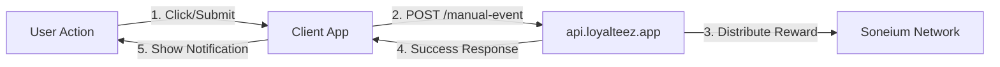

# SaaS Demo - Loyalteez Integration

> **A modern Next.js SaaS demonstration showing how to integrate the Loyalteez Reward API**  
> Boost user engagement, retention, and conversion with crypto rewards.

[](https://opensource.org/licenses/MIT)
[](https://nextjs.org/)
[](https://www.typescriptlang.org/)
[](https://saas-demo.loyalteez.app)

**What this does:** A fully functional SaaS landing page, pricing page, and profile dashboard that rewards users with LTZ tokens for key actions. It demonstrates **Client-Side Direct API** integration pattern.

**Live Demo:** [saas-demo.loyalteez.app](https://saas-demo.loyalteez.app)

---

## 🚀 Features

✅ **Newsletter Signup** (Acquisition) - Users earn LTZ tokens for subscribing.  
✅ **Profile Completion** (Activation) - Rewards for filling out user profile details.  
✅ **Subscription Upgrade** (Revenue) - Significant bonus for upgrading to paid plans.  
✅ **Direct API Integration** - Calls `api.loyalteez.app` directly from the browser.  
✅ **Real-time Feedback** - Instant UI updates upon reward distribution.

---

## 🏗️ Architecture

The demo uses a **Client-Side Direct API Pattern** - the simplest and most reliable approach.



**Key Components:**
- **`src/app/page.tsx`**: Landing page with Newsletter hook (calls API directly).
- **`src/app/profile/page.tsx`**: Profile page with Completion hook.
- **`src/app/pricing/page.tsx`**: Pricing page with Upgrade hook.

---

## 🛠️ Tech Stack

*   **Framework**: [Next.js 14](https://nextjs.org/) (App Router)
*   **Styling**: [Tailwind CSS](https://tailwindcss.com/)
*   **Language**: TypeScript
*   **Icons**: [Lucide React](https://lucide.dev/)
*   **Deployment**: [Cloudflare Pages](https://pages.cloudflare.com/)
*   **Rewards**: [Loyalteez API](https://docs.loyalteez.app) (`api.loyalteez.app`)

---

## 🚀 Getting Started

### Prerequisites

- Node.js 18+ installed
- A Loyalteez Brand ID (get one at [partners.loyalteez.app](https://partners.loyalteez.app))

### Installation

1.  **Clone the repository**
    ```bash
    git clone https://github.com/Alpha4-Labs/saas-demo-loyalteez.git
    cd saas-demo-loyalteez
    ```

2.  **Install dependencies**
    ```bash
    npm install
    ```

3.  **Configure Environment**
    Copy `.env.example` to `.env.local`:
    ```bash
    cp .env.example .env.local
    ```
    Then edit `.env.local` and add your Loyalteez Brand ID (get one at [partners.loyalteez.app](https://partners.loyalteez.app)):
    ```env
    NEXT_PUBLIC_BRAND_ID=0xYourBrandWalletAddress
    ```

4.  **Run Development Server**
    ```bash
    npm run dev
    ```
    Open [http://localhost:3000](http://localhost:3000) to see the app.

---

## 📖 Integration Guide

This demo showcases the **Client-Side Direct API** pattern - the simplest way to integrate Loyalteez.

### Example: Newsletter Signup

```typescript
// Client-side code (React component)
const res = await fetch('https://api.loyalteez.app/loyalteez-api/manual-event', {
  method: 'POST',
  headers: { 'Content-Type': 'application/json' },
  body: JSON.stringify({
    brandId: process.env.NEXT_PUBLIC_BRAND_ID,
    eventType: 'newsletter_subscribe',
    userEmail: email,
    userIdentifier: email,
    domain: 'saas-demo.loyalteez.app',
    sourceUrl: 'https://saas-demo.loyalteez.app',
    metadata: { source: 'homepage_hero' }
  }),
});

const data = await res.json();
if (data.success) {
  // Show success message with reward amount
}
```

**Why Client-Side?**
- ✅ Simpler architecture (no server-side proxy needed)
- ✅ Brand ID is public anyway (wallet address)
- ✅ Works reliably across all hosting platforms
- ✅ Matches the Discord bot pattern

**Note:** In a production app, you'd replace the placeholder `user@example.com` with actual user email from your authentication system. The demo uses placeholders for simplicity.

---

## 📂 Project Structure

```
src/
├── app/
│   ├── pricing/          # Pricing page (Upgrade hook)
│   ├── profile/          # Profile page (Completion hook)
│   └── page.tsx          # Landing page (Newsletter hook)
└── components/           # UI Components
```

---

## 🤝 Contributing

Contributions are welcome! Please read our [Contributing Guidelines](CONTRIBUTING.md) first.

1.  Fork the repository
2.  Create your feature branch (`git checkout -b feature/amazing-feature`)
3.  Commit your changes (`git commit -m 'Add some amazing feature'`)
4.  Push to the branch (`git push origin feature/amazing-feature`)
5.  Open a Pull Request

---

## 📄 License

This project is licensed under the MIT License - see the [LICENSE](LICENSE) file for details.

---

## 🆘 Support

- **Documentation**: [docs.loyalteez.app](https://docs.loyalteez.app)
- **Issues**: [GitHub Issues](https://github.com/Alpha4-Labs/saas-demo-loyalteez/issues)
- **Email**: support@loyalteez.app
