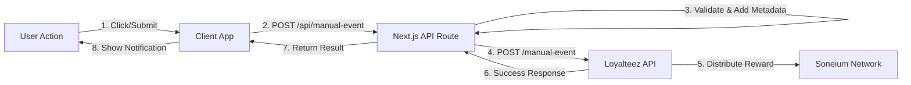

# SaaS Demo - Loyalteez Integration

> **A modern Next.js SaaS demonstration showing how to integrate the Loyalteez Reward API**  
> Boost user engagement, retention, and conversion with crypto rewards.

[](https://opensource.org/licenses/MIT)
[](https://nextjs.org/)
[](https://www.typescriptlang.org/)
[](https://saas-demo.loyalteez.app)

**What this does:** A fully functional SaaS landing page, pricing page, and profile dashboard that rewards users with LTZ tokens for key actions. It demonstrates the **Server-Side (API)** integration pattern using Next.js API Routes.

**Live Demo:** [saas-demo.loyalteez.app](https://saas-demo.loyalteez.app)

---

## 🚀 Features

✅ **Newsletter Signup** (Acquisition) - Users earn LTZ tokens for subscribing.  
✅ **Profile Completion** (Activation) - Rewards for filling out user profile details.  
✅ **Subscription Upgrade** (Revenue) - Significant bonus for upgrading to paid plans.  
✅ **Secure API Proxy** - Hides your Brand ID and logic behind a server-side API route.  
✅ **Edge Runtime** - Optimized for Cloudflare Pages and Vercel Edge functions.  
✅ **Real-time Feedback** - Instant UI updates upon reward distribution.

---

## 🏗️ Architecture

The demo uses a **Server-Side Proxy Pattern** to ensure security and flexibility.



**Key Components:**
- **`src/app/api/manual-event/route.ts`**: The secure proxy that communicates with Loyalteez.
- **`src/lib/loyalteez.ts`**: A typed utility wrapper for the Loyalteez API.
- **`src/app/page.tsx`**: Landing page with Newsletter hook.

---

## 🛠️ Tech Stack

*   **Framework**: [Next.js 14](https://nextjs.org/) (App Router)
*   **Styling**: [Tailwind CSS](https://tailwindcss.com/)
*   **Language**: TypeScript
*   **Icons**: [Lucide React](https://lucide.dev/)
*   **Deployment**: [Cloudflare Pages](https://pages.cloudflare.com/)
*   **Rewards**: [Loyalteez API](https://docs.loyalteez.app)

---

## 🚀 Getting Started

### Prerequisites

- Node.js 18+ installed
- A Loyalteez Brand ID (get one at [partners.loyalteez.app](https://partners.loyalteez.app))

### Installation

1.  **Clone the repository**
    ```bash
    git clone https://github.com/Alpha4-Labs/saas-demo-loyalteez.git
    cd saas-demo-loyalteez
    ```

2.  **Install dependencies**
    ```bash
    npm install
    ```

3.  **Configure Environment**
    Create a `.env.local` file in the root directory:
    ```env
    # Your Loyalteez Brand ID (Wallet Address)
    NEXT_PUBLIC_BRAND_ID=0xYourBrandWalletAddress
    ```

4.  **Run Development Server**
    ```bash
    npm run dev
    ```
    Open [http://localhost:3000](http://localhost:3000) to see the app.

---

## 📖 Integration Guide

This demo showcases the **best practice** for integrating Loyalteez into a JavaScript framework.

### 1. The Service Wrapper (`src/lib/loyalteez.ts`)

We use a singleton service class to handle all communication with the Loyalteez API. This ensures consistent error handling, type safety, and centralized configuration.

```typescript
// Usage example
import { loyalteez } from '@/lib/loyalteez';

await loyalteez.trackEvent('event_name', 'user@example.com', {
    metadata_key: 'value'
});
```

### 2. Secure Proxy Route (`src/app/api/manual-event/route.ts`)

Never call the Loyalteez API directly from the client-side if you want to keep your logic opaque or handle secrets. Instead, call your own API route.

```typescript
// Client-side code
const res = await fetch('/api/manual-event', {
  method: 'POST',
  body: JSON.stringify({ eventType: 'newsletter_subscribe', userEmail: email }),
});
```

---

## 📂 Project Structure

```
src/
├── app/
│   ├── api/
│   │   ├── manual-event/ # Secure proxy for Loyalteez API calls
│   │   └── auth/         # Example NextAuth integration point
│   ├── pricing/          # Pricing page (Upgrade hook)
│   ├── profile/          # Profile page (Completion hook)
│   └── page.tsx          # Landing page (Newsletter hook)
├── lib/
│   └── loyalteez.ts      # Loyalteez API wrapper service
└── components/           # UI Components
```

---

## 🤝 Contributing

Contributions are welcome! Please read our [Contributing Guidelines](CONTRIBUTING.md) first.

1.  Fork the repository
2.  Create your feature branch (`git checkout -b feature/amazing-feature`)
3.  Commit your changes (`git commit -m 'Add some amazing feature'`)
4.  Push to the branch (`git push origin feature/amazing-feature`)
5.  Open a Pull Request

---

## 📄 License

This project is licensed under the MIT License - see the [LICENSE](LICENSE) file for details.

---

## 🆘 Support

- **Documentation**: [docs.loyalteez.app](https://docs.loyalteez.app)
- **Issues**: [GitHub Issues](https://github.com/Alpha4-Labs/saas-demo-loyalteez/issues)
- **Email**: support@loyalteez.app
